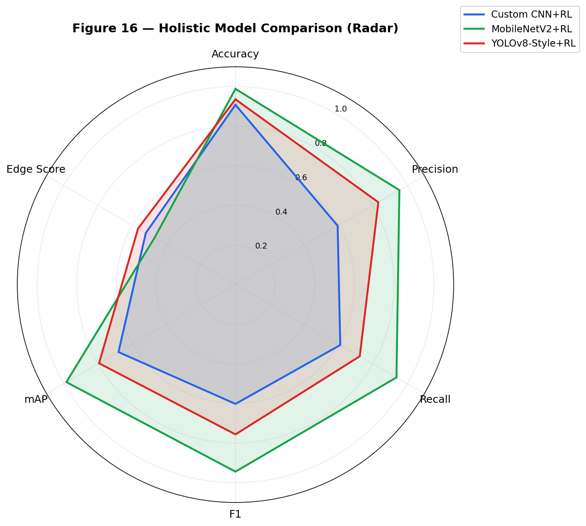
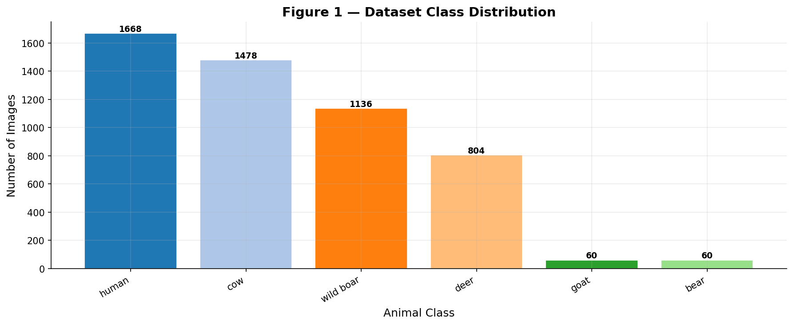
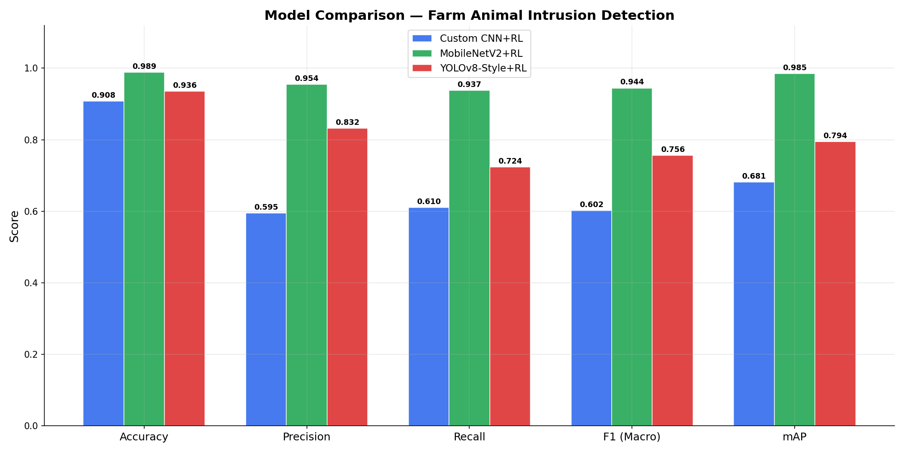
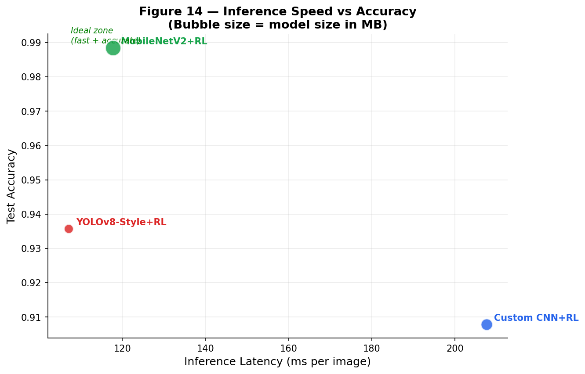
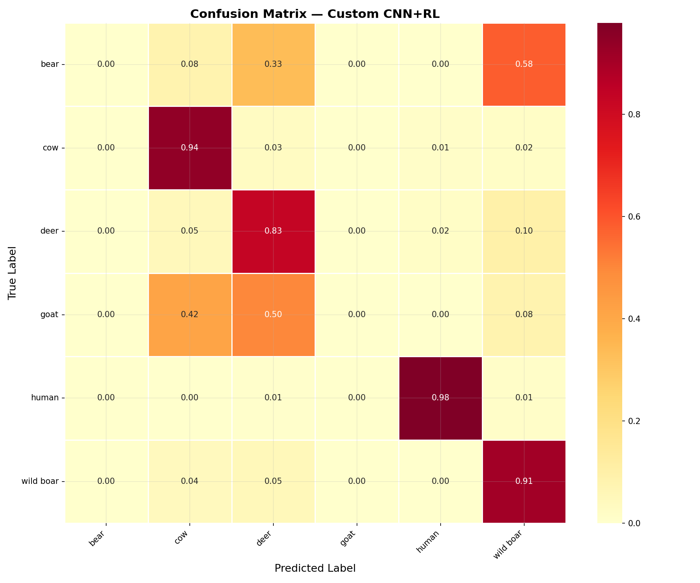
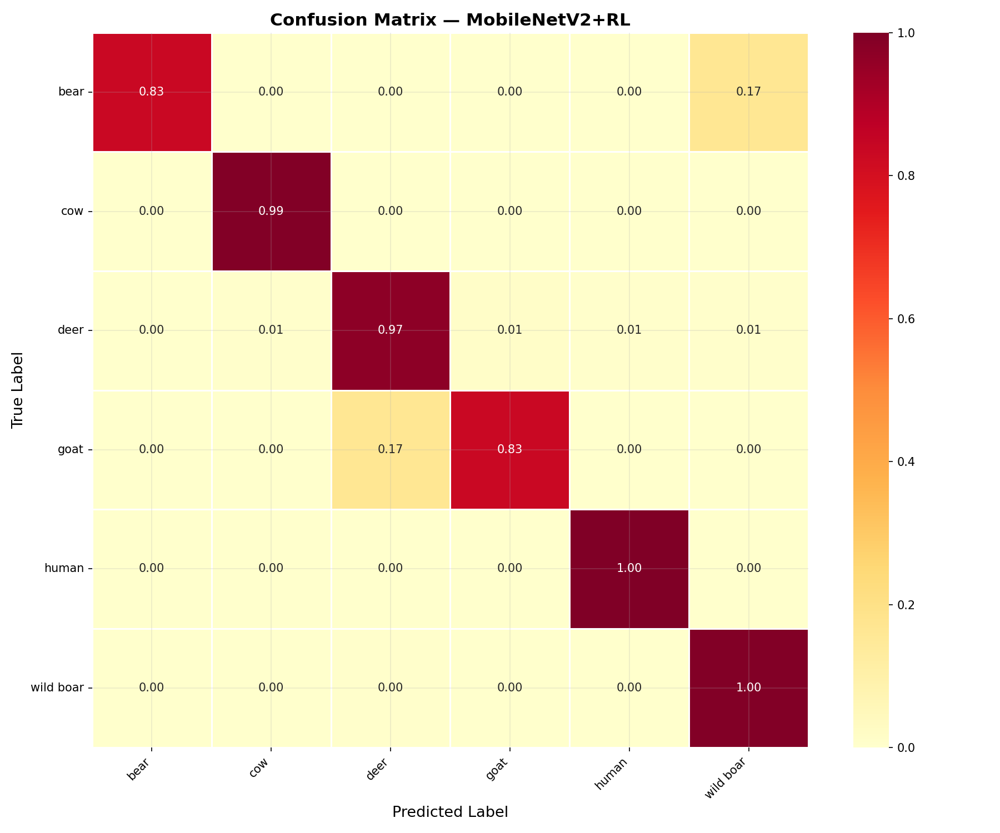
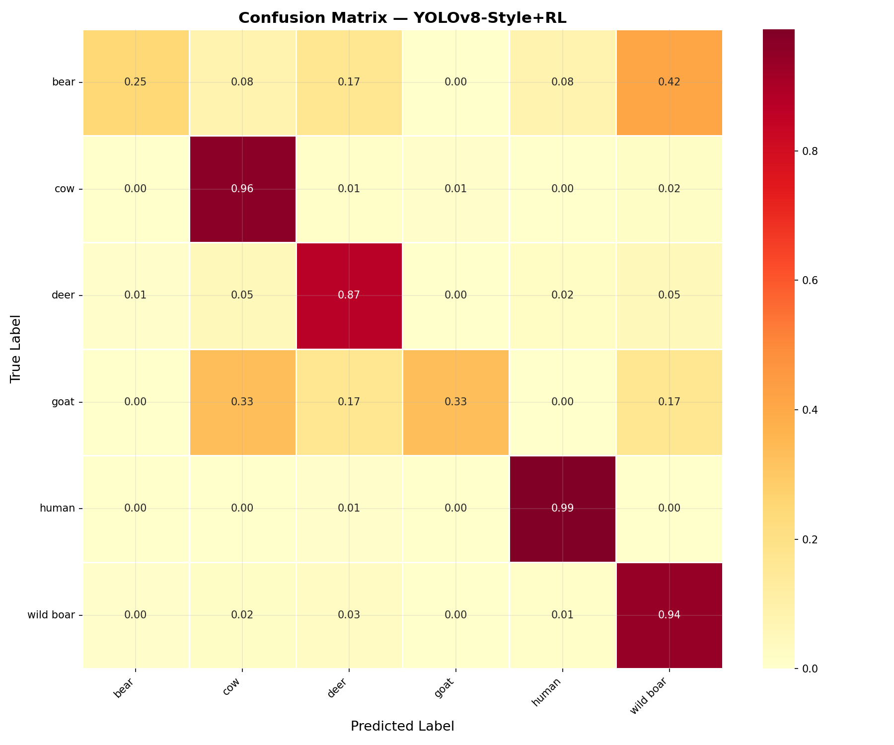
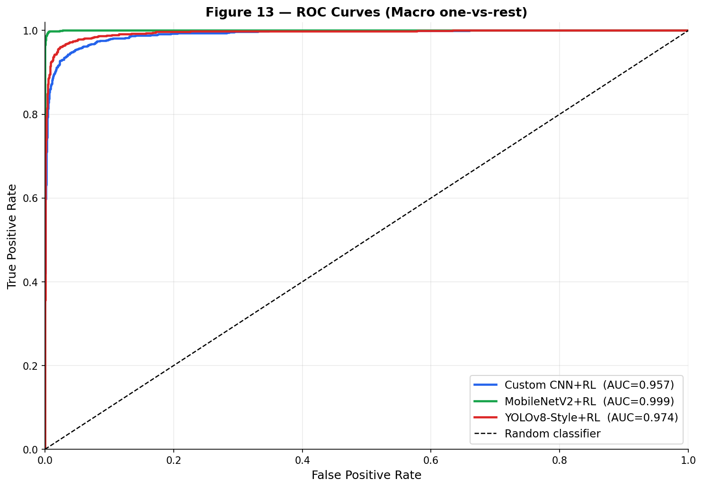
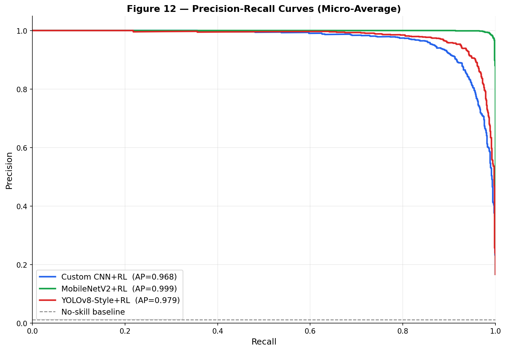
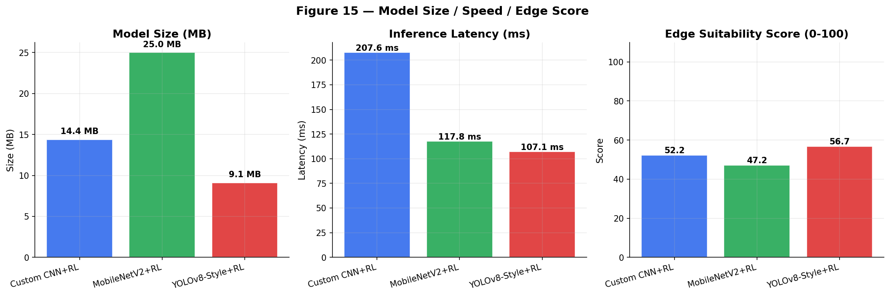

# AI-Based Edge-Enabled Adaptive Farm Animal Intrusion Prevention System

<p align="center">
  
</p>

<p align="center">
  <b>PhD Research Project — 2026</b><br/>
  <b>Author: Poonam Bobade</b>
</p>

<p align="center">
  
  
  
  
  
  
</p>

---

## Abstract

A fully autonomous, **solar-powered, offline edge-AI system** for farm perimeter protection against animal intrusions. The system uses a two-node architecture:

- **Master Node (Raspberry Pi 5):** Runs a dual-model AI pipeline (YOLOv8n + MobileNetV2) with a Reinforcement Learning (REINFORCE) adapter for real-time threshold adaptation.
- **Actuator Node (ESP32):** Receives wireless commands over LoRa (433 MHz, ~1 km range) to control a 110 dB siren and high-intensity floodlights.

The AI pipeline detects **6 animal classes** — Bear, Cow, Deer, Goat, Human, and Wild Boar — using a thermal pre-trigger stage to save power. The entire edge node runs off a **20W solar panel + 5200 mAh Li-ion battery**, requiring zero internet connectivity.

Three deep learning models were trained and compared, each augmented with an RL adaptation layer:

| Model | Accuracy | mAP | Latency | Model Size | Edge Score |
|:---|:---:|:---:|:---:|:---:|:---:|
| Custom CNN + RL | 90.79% | 0.6811 | 207.6 ms | 14.37 MB | 52.18 |
| **MobileNetV2 + RL** | **98.85%** | **0.9845** | 117.8 ms | 25.00 MB | 47.16 |
| YOLOv8-Style + RL | 93.57% | 0.7942 | **107.1 ms** | **9.11 MB** | **56.70** |

> **Conclusion:** MobileNetV2+RL achieves the highest accuracy. YOLOv8-Style+RL achieves the best edge suitability score. The production deployment fuses both models for optimal real-world performance.

---

## System Architecture

```
                    ┌──────────────────────────────────────────────┐
                    │          MASTER NODE — Raspberry Pi 5        │
                    │                                              │
  [Solar/Battery]   │  Stage 1: MLX90640 Thermal Camera           │
       │            │  ├─ Reads 768 pixels @ 2 Hz                 │
  [Buck→5V]──────→  │  ├─ Hot-pixel threshold: ≥20 px > 30°C      │
                    │  └─ Triggers Stage 2 on anomaly             │
                    │                                              │
                    │  Stage 2: RPi Camera v2 + Dual AI Model      │
                    │  ├─ YOLOv8n  → object detection             │
                    │  ├─ MobileNetV2 → classification             │
                    │  ├─ Fused decision (confidence-weighted)     │
                    │  └─ Matched against DETERRENT_MAP            │
                    │                                              │
                    │  LoRa SX1276 (SPI0, GPIO23 RST)             │
                    └────────────────────┬─────────────────────────┘
                                         │  433 MHz LoRa (~1 km)
                    ┌────────────────────▼─────────────────────────┐
                    │          ACTUATOR NODE — ESP32                │
                    │                                              │
                    │  LoRa SX1276 RX → parse command             │
                    │  GPIO 26 → Relay → 110 dB Siren             │
                    │  GPIO 25 → Relay → High-Intensity Lights     │
                    │  Watchdog: all OFF if no heartbeat 2 min     │
                    └──────────────────────────────────────────────┘
```

---

## Key Research Figures

<table>
  <tr>
    <td align="center"><br/><sub>Dataset Distribution</sub></td>
    <td align="center"><br/><sub>Model Metric Comparison</sub></td>
    <td align="center"><br/><sub>Speed vs Accuracy Tradeoff</sub></td>
  </tr>
  <tr>
    <td align="center"><br/><sub>Custom CNN Confusion Matrix</sub></td>
    <td align="center"><br/><sub>MobileNetV2 Confusion Matrix</sub></td>
    <td align="center"><br/><sub>YOLOv8-Style Confusion Matrix</sub></td>
  </tr>
  <tr>
    <td align="center"><br/><sub>ROC-AUC Curves</sub></td>
    <td align="center"><br/><sub>Precision-Recall Curves</sub></td>
    <td align="center"><br/><sub>Model Size vs Speed vs Edge Score</sub></td>
  </tr>
</table>

---

## Per-Class Results

| Class | Custom CNN+RL (F1) | MobileNetV2+RL (F1) | YOLOv8-Style+RL (F1) |
|:---|:---:|:---:|:---:|
| **Bear** | 0.0000 ❌ | 0.9091 ✅ | 0.3529 |
| **Cow** | 0.9316 | 0.9949 ✅ | 0.9516 |
| **Deer** | 0.8196 | 0.9750 ✅ | 0.8833 |
| **Goat** | 0.0000 ❌ | 0.8000 ✅ | 0.4444 |
| **Human** | 0.9790 | **0.9985** ✅ | 0.9821 |
| **Wild Boar** | 0.8841 | **0.9891** ✅ | 0.9241 |

---

## Repository Structure

```
ai-based-edge-enabled-wild-animal-prevention-system/
│
├── README.md                            ← This file
├── requirements.txt                     ← Python dependencies
├── PROJECT_EXPLANATION.md               ← Detailed methodology & result explanation
├── PROJECT_GUIDE.md                     ← Full technical reference & deployment guide
├── RESULTS.md                           ← Experimental results summary tables
│
├── dataset_utils.py                     ← Dataset loading, augmentation, train/val/test split
├── model1_custom_cnn.py                 ← Custom VGG-style CNN + REINFORCE RL
├── model2_mobilenet.py                  ← MobileNetV2 transfer learning + REINFORCE RL
├── model3_yolo.py                       ← YOLOv8-Style CSP network + Threshold RL
├── metrics_utils.py                     ← All metrics: F1, mAP, Edge Score, charts
├── edge_inference.py                    ← Raspberry Pi 5 inference pipeline
├── phd_research_notebook.ipynb          ← Main PhD research notebook (full pipeline)
│
├── logic/
│   ├── farm_intrusion_master.py         ← Pi 5 production master script
│   ├── adaptive_retrain.py              ← Nightly/triggered adaptive retraining
│   └── esp32_wildlife_listener.ino      ← ESP32 Arduino firmware (actuator node)
│
├── dataset/                             ← 5200+ training images across 6 classes
│   ├── bear/
│   ├── cow/
│   ├── deer/
│   ├── goat/
│   ├── human/
│   └── wild boar/
│
├── test/                                ← Custom test images (held-out evaluation)
│   ├── cow/
│   ├── deer/
│   └── human/
│
└── results/
    ├── figures/                         ← 18 research PNG charts
    ├── logs/                            ← Training history JSON + per-class CSV files
    └── tflite/
        ├── best_model_int8.tflite       ← INT8 quantised model for Raspberry Pi 5
        └── class_labels.txt
```

---

## Dataset

The dataset contains **5,200+ images** across **6 classes** relevant to farm intrusion scenarios:

| Class | Threat Level | Why Included |
|:---|:---:|:---|
| 🐻 Bear | High | Predator, highest priority threat |
| 🐄 Cow | Medium | Could be own livestock or neighbour's |
| 🦌 Deer | Medium | Common crop-damage animal |
| 🐐 Goat | Low-Med | Common in South Asian / African farms |
| 🧑 Human | Context | Farm worker (day) vs intruder (night) |
| 🐗 Wild Boar | High | Major crop destruction threat |

**Preprocessing Pipeline (`dataset_utils.py`):**
- Resize to 224×224 pixels
- Normalize pixel values to [0, 1]
- Stratified split: **70% train / 10% validation / 20% test**
- Augmentation: random horizontal flip, ±20% brightness/contrast/saturation

---

## Models

### Model 1 — Custom CNN + REINFORCE RL (`model1_custom_cnn.py`)
- 4-block VGG-style CNN trained from scratch
- Batch Normalization + Dropout + L2 regularization
- REINFORCE policy gradient RL adapter on softmax outputs
- Size: **14.37 MB** | Latency: **207.6 ms** | Accuracy: **90.79%**

### Model 2 — MobileNetV2 + REINFORCE RL (`model2_mobilenet.py`)
- ImageNet-pretrained MobileNetV2 backbone (depthwise separable convolutions)
- Two-phase training: frozen backbone → fine-tune top 30 layers
- Same REINFORCE RL adapter
- Deployed as primary classifier on Raspberry Pi 5 (TFLite int8)
- Size: **25.00 MB** | Latency: **117.8 ms** | Accuracy: **98.85%**

### Model 3 — YOLOv8-Style + Threshold RL (`model3_yolo.py`)
- CSP (Cross-Stage Partial) blocks with LeakyReLU
- RL adapter adjusts per-class confidence thresholds dynamically
- Smallest and fastest model — best edge suitability score
- Size: **9.11 MB** | Latency: **107.1 ms** | Accuracy: **93.57%**

### Production Fusion Logic
```python
if both_models_agree:
    label = agreed_class
    confidence = max(yolo_conf, mobilenet_conf)
elif mobilenet_conf > yolo_conf + 0.15:
    label = mobilenet_label
else:
    label = yolo_label
```

---

## Reinforcement Learning Adaptation

All three models use a **REINFORCE (Policy Gradient)** RL adapter that operates on top of the base classifier without retraining it:

- **Models 1 & 2:** Policy MLP (Dense→Dense→Softmax) learns which class to alert/suppress based on rewards (+1 correct, −1 false alarm)
- **Model 3:** Per-class confidence threshold adaptation using exponential decay on FP/FN rates

This enables **continuous online adaptation** to field conditions (lighting changes, seasonal variations, new animals) without retraining the full CNN.

---

## Hardware

| Component | Specification |
|:---|:---|
| Master Node | Raspberry Pi 5 (4 GB RAM, BCM2712, 4× A76 @ 2.4 GHz) |
| RGB Camera | RPi Camera Module v2 (Sony IMX219, 8 MP) |
| Thermal Camera | MLX90640 (32×24 px, I2C, 2 Hz, Stage 1 trigger) |
| Actuator Node | ESP32 Dev Module (dual-core LX6 @ 240 MHz) |
| Wireless | LoRa SX1276 (433 MHz, ~1 km LOS range, CSS modulation) |
| Deterrents | 110 dB Siren + High-intensity LED flood lights (relay-controlled) |
| Power (edge) | 20W solar panel + 5200 mAh Li-ion battery (~14 hr backup) |

---

## Day / Night Deterrent Logic

| Time | Human Detected | Standard Animal | High-Priority Animal |
|:---|:---:|:---:|:---:|
| **Day (06:00–19:00)** | Log only | Siren only | Siren only |
| **Night (19:00–06:00)** | Lights only | Siren + Lights | Siren + Lights |

---

## Quick Start

### 1. Clone & Install Dependencies (Windows / Linux PC)

```bash
git clone https://github.com/bobadepoonam/ai-based-edge-enabled-wild-animal-prevention-system.git
cd ai-based-edge-enabled-wild-animal-prevention-system
pip install -r requirements.txt
```

### 2. Run the Research Notebook

```bash
jupyter notebook phd_research_notebook.ipynb
```

### 3. Raspberry Pi 5 Deployment

```bash
# On Raspberry Pi OS Lite (64-bit):
sudo apt update && sudo apt install -y python3-pip python3-venv libopencv-dev
sudo raspi-config  # Enable SPI, I2C, Camera

python3 -m venv ~/venv && source ~/venv/bin/activate
pip install tensorflow-lite-runtime opencv-python-headless numpy \
            ultralytics spidev lgpio adafruit-blinka \
            adafruit-circuitpython-mlx90640

# Copy files to Pi (from Windows):
scp results/tflite/best_model_int8.tflite pi@raspberrypi.local:/home/pi/farm/
scp logic/farm_intrusion_master.py pi@raspberrypi.local:/home/pi/farm/
scp logic/adaptive_retrain.py pi@raspberrypi.local:/home/pi/farm/

# Run on Pi:
python3 farm_intrusion_master.py
```

### 4. ESP32 Firmware

1. Open Arduino IDE → Install **LoRa by Sandeep Mistry**
2. Board: **ESP32 Dev Module**
3. Open `logic/esp32_wildlife_listener.ino`
4. Upload to ESP32

---

## Training Times

| Model | Time |
|:---|:---:|
| Custom CNN + RL | ~479 minutes (8 hrs) |
| MobileNetV2 + RL | ~27 minutes |
| YOLOv8-Style + RL | ~143 minutes (2.4 hrs) |

> Training was performed on a Windows PC (CPU). Models are exported and deployed to Raspberry Pi — Pi only runs inference (~100–200 ms/frame), never training.

---

## Troubleshooting

| Error | Fix |
|:---|:---|
| `UnicodeEncodeError` | `python -X utf8 script.py` |
| GPIO 23 busy | `sudo pinctrl set 23 ip` → rerun |
| LoRa not communicating | Check frequency, sync word `0x12`, pin wiring |
| MobileNet not found on Pi | Copy `.keras` file, check `MOBILENET_PATH` |
| TFLite import error | `pip install tensorflow-lite-runtime` |
| MLX90640 I2C error | Enable I2C via `sudo raspi-config` |
| Camera capture fail | Enable Camera via `sudo raspi-config`, check ribbon cable |

---

## Research Contributions

1. **Novel three-way comparison** of architecturally distinct models (from-scratch CNN vs. transfer learning vs. YOLO-style) on a custom farm-animal intrusion dataset
2. **RL integration** as a real-time adaptive layer on top of static classifiers — enabling continuous improvement without full retraining
3. **Full system design** covering solar power calculation, LoRa communication protocol, and Raspberry Pi 5 embedded deployment
4. **Edge-aware evaluation** using a composite Edge Score metric accounting for real hardware constraints beyond accuracy alone

---

## Citation

If you use this work, please cite:

```bibtex
@phdthesis{bobade2025farmAI,
  author  = {Poonam Bobade},
  title   = {AI-Based Edge-Enabled Adaptive Farm Animal Intrusion Prevention System},
  school  = {[University Name]},
  year    = {2025}
}
```

---

## License

This repository is shared for **academic research verification purposes only** as requested by the publisher. All rights reserved © Poonam Bobade, 2025.

---

<p align="center">
  <i>AI-Based Edge-Enabled Adaptive Farm Animal Intrusion Prevention System — PhD Research 2025</i><br/>
  <i>Poonam Bobade</i>
</p>
